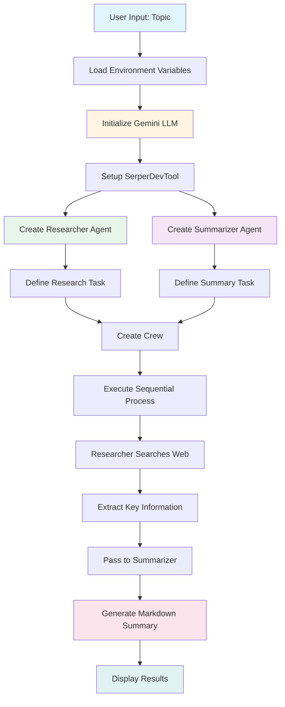
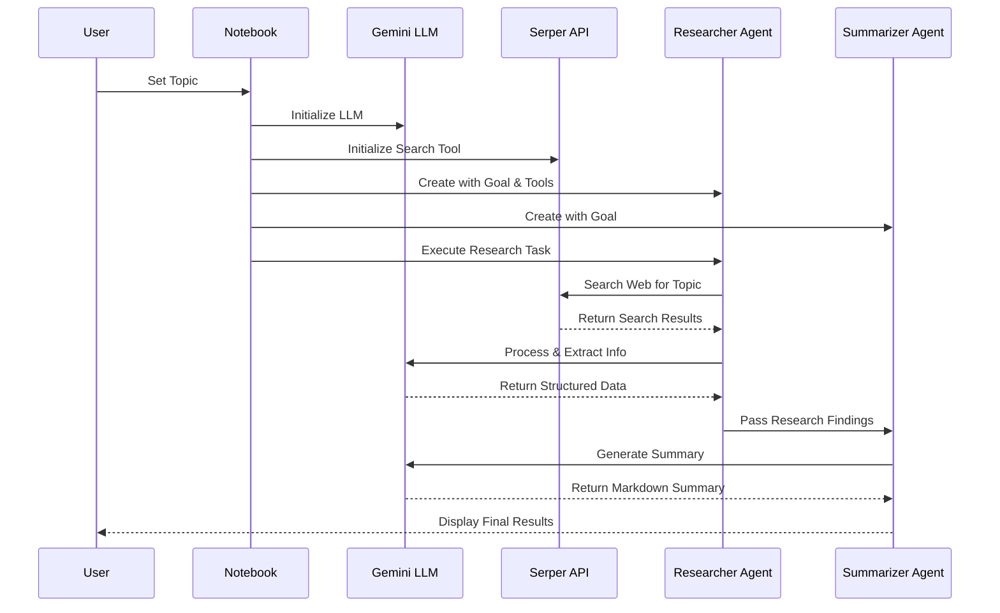
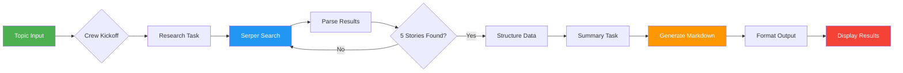

# Web Research Agent

[](https://www.python.org/downloads/)
[](https://www.crewai.com/)
[](https://opensource.org/licenses/MIT)
[](https://jupyter.org/)

## 📋 Overview

This intelligent web research agent uses CrewAI to automate web scraping and content summarization. It leverages multiple AI agents working together to search the internet for recent information on any topic and generate well-structured, markdown-formatted summaries. The system uses Google's Gemini AI for language processing and Serper API for web searches.

## 🎯 What This Notebook Does

- **Intelligent Web Search**: Uses SerperDevTool to search for the most recent and relevant information on any topic
- **Multi-Agent Collaboration**: Coordinates two specialized AI agents:
  - **Researcher Agent**: Searches the web and extracts key information (title, source, key points, publication date)
  - **Summarizer Agent**: Creates concise, well-structured markdown summaries of findings
- **Automated Workflow**: Sequential processing ensures research is completed before summarization begins
- **Markdown Output**: Generates professional, formatted summaries ready for documentation or reports
- **Customizable Topics**: Simply change the topic variable to research any subject
- **Real-time Results**: Uses Google Gemini 2.0 Flash for fast, accurate responses

## 🚀 Quick Start

### Prerequisites

```bash
# Install required packages
pip install crewai "crewai[tools]" google-generativeai python-dotenv
```

### Environment Setup

Create a `.env` file in your project directory with your API keys:

```env
GEMINI_API_KEY=your_gemini_api_key_here
SERPER_API_KEY=your_serper_api_key_here
```

**Getting API Keys:**
- **Gemini API**: Get your key from [Google AI Studio](https://makersuite.google.com/app/apikey)
- **Serper API**: Sign up at [Serper.dev](https://serper.dev/) for web search capabilities

### Running the Notebook

1. Clone or download the notebook
2. Create your `.env` file with API keys
3. Open Jupyter Notebook:
   ```bash
   jupyter notebook main.ipynb
   ```
4. Run all cells sequentially

## 🔧 How to Modify for Your Query

### 1. Change the Research Topic

Locate **Step 5** in the notebook and modify the `topic` variable:

```python
# Original
topic = "latest AI breakthroughs"

# Modified for your research
topic = "quantum computing advances"
topic = "renewable energy innovations"
topic = "space exploration news"
```

### 2. Customize Search Parameters

Adjust the search tool configuration in **Step 4**:

```python
# Change number of results
search_tool = SerperDevTool(
    n_results=10,      # Change to 5, 15, 20 etc.
    country="in",      # Change to "us", "uk", "ca" etc.
    locale="en"        # Change to "es", "fr", "de" etc.
)
```

### 3. Modify Agent Behavior

Customize agent goals and backstories in **Step 5**:

```python
# Researcher agent customization
researcher = Agent(
    role="Technical Research Specialist",  # Change role
    goal=f"Find the top 10 academic papers about {topic}",  # Modify goal
    backstory="PhD researcher with 15 years experience...",  # Update backstory
    tools=[search_tool],
    llm=gemini_llm,
    verbose=True,
    allow_delegation=False
)

# Summarizer agent customization
summarizer = Agent(
    role="Executive Summary Writer",  # Change role
    goal="Create executive briefings for C-level executives",  # Modify goal
    backstory="Former McKinsey consultant...",  # Update backstory
    llm=gemini_llm,
    verbose=True,
    allow_delegation=False
)
```

### 4. Adjust Task Requirements

Modify task descriptions in **Step 6**:

```python
# Research task
research_task = Task(
    description=f"""Search for the top 10 academic papers about '{topic}'.
    For each paper, collect:
    - Title and authors
    - Abstract
    - Key findings
    - Citation count
    - DOI/Link
    
    Focus on peer-reviewed sources from the last 2 years.""",
    expected_output="A detailed list of 10 papers with all metadata",
    agent=researcher
)

# Summary task
summary_task = Task(
    description="""Create an executive summary in bullet points.
    Include:
    - Main themes across all papers
    - Top 3 breakthrough findings
    - Future research directions
    - Practical applications
    
    Keep it under 500 words.""",
    expected_output="Executive summary in markdown format",
    agent=summarizer,
    context=[research_task]
)
```

### 5. Change LLM Model or Settings

Modify the Gemini configuration in **Step 3**:

```python
# Use different Gemini model
gemini_llm = LLM(
    model='gemini/gemini-pro',  # Or 'gemini/gemini-2.0-flash-exp'
    api_key=os.getenv("GEMINI_API_KEY"),
    temperature=0.7,  # Higher = more creative (0.0-1.0)
    verbose=True      # Enable for debugging
)
```

### 6. Add More Agents

Extend the system with additional agents:

```python
# Add a fact-checker agent
fact_checker = Agent(
    role="Fact Verification Specialist",
    goal="Verify claims and cross-reference sources",
    backstory="Experienced journalist with expertise in fact-checking",
    llm=gemini_llm,
    verbose=True,
    allow_delegation=False
)

# Add a fact-checking task
fact_check_task = Task(
    description="Verify all claims in the research findings",
    expected_output="Fact-check report with source verification",
    agent=fact_checker,
    context=[research_task]
)

# Update crew with new agent and task
crew = Crew(
    agents=[researcher, fact_checker, summarizer],
    tasks=[research_task, fact_check_task, summary_task],
    process=Process.sequential,
    verbose=True
)
```

## 📊 System Architecture



## 🔄 Agent Workflow



## 🎨 Data Flow Diagram



## 📁 Project Structure

```
project/
│
├── main.ipynb              # Main notebook with all steps
├── .env                    # Environment variables (not in repo)
├── .env.example           # Template for environment variables
├── README.md              # This file
├── requirements.txt       # Python dependencies
├── LICENSE               # License information
│
├── outputs/              # Generated summaries (optional)
│   ├── summaries/       # Markdown summaries
│   └── logs/            # Execution logs
│
└── docs/                # Additional documentation (optional)
    ├── examples/        # Example queries and outputs
    └── troubleshooting.md
```

## 🔑 Key Features

### Multi-Agent System
- **Collaborative Intelligence**: Two specialized agents work together for comprehensive research
- **Sequential Processing**: Research completes before summarization begins
- **No Delegation**: Each agent focuses on its specific expertise

### Advanced Search Capabilities
- **Real-time Web Search**: Uses Serper API for current information
- **Configurable Results**: Adjust number of results, country, and language
- **Smart Filtering**: Focuses on recent and credible sources

### Intelligent Summarization
- **Markdown Formatting**: Professional, ready-to-use output
- **Key Information Extraction**: Title, source, key points, dates
- **Concise & Clear**: 2-3 sentence summaries highlighting main insights

### Customization Options
- **Flexible Topics**: Research any subject
- **Adjustable Parameters**: Control search depth and output format
- **Extensible Architecture**: Easy to add more agents or tasks

## 📝 Example Usage

### Basic Research Query

```python
# Set your topic
topic = "artificial intelligence in healthcare"

# Create and run the crew (Steps 5-7)
crew = Crew(
    agents=[researcher, summarizer],
    tasks=[research_task, summary_task],
    process=Process.sequential,
    verbose=True
)

result = crew.kickoff(inputs={'topic': topic})
```

### Sample Output

```markdown
## Top 5 AI Breakthroughs

1. **Headline:** AI Diagnostic Tool Achieves 95% Accuracy
   **Summary:** Researchers developed an AI system that diagnoses rare diseases 
   with 95% accuracy, outperforming traditional methods. The tool analyzes 
   medical imaging and patient history to identify conditions within minutes.
   **Source:** nature.com

2. **Headline:** Machine Learning Predicts Patient Outcomes
   ...
```

## 🛠️ Configuration Options

### Environment Variables

```env
# Required
GEMINI_API_KEY=your_key_here
SERPER_API_KEY=your_key_here

# Optional
CREW_VERBOSE=True
MAX_RETRIES=3
TIMEOUT=120
```

### LLM Parameters

| Parameter | Default | Range | Description |
|-----------|---------|-------|-------------|
| temperature | 0.1 | 0.0-1.0 | Controls randomness (lower = more focused) |
| max_tokens | Auto | 1-8192 | Maximum response length |
| top_p | 1.0 | 0.0-1.0 | Nucleus sampling parameter |

### Search Tool Options

| Parameter | Default | Options | Description |
|-----------|---------|---------|-------------|
| n_results | 10 | 1-100 | Number of search results |
| country | "in" | ISO codes | Search region |
| locale | "en" | Language codes | Search language |

## 🤝 Contributing

Contributions are welcome! Here's how you can help:

1. Fork the repository
2. Create a feature branch (`git checkout -b feature/AmazingFeature`)
3. Commit your changes (`git commit -m 'Add some AmazingFeature'`)
4. Push to the branch (`git push origin feature/AmazingFeature`)
5. Open a Pull Request

### Development Guidelines
- Follow PEP 8 style guide
- Add docstrings to functions
- Update README with new features
- Test with multiple topics

## 📄 License

This project is licensed under the MIT License - see the [LICENSE](LICENSE) file for details.

## 👥 Authors

- **Yash Suman** - [Github](https://github.com/yashsuman15)

## 🙏 Acknowledgments

- **CrewAI**: Framework for orchestrating AI agents
- **Google Gemini**: Powerful language model
- **Serper**: Web search API
- Built with: Python, Jupyter, CrewAI, Gemini API

## 🐛 Known Issues

- Serper API has rate limits (check your plan)
- Some websites may block scraping attempts
- Long topics may exceed token limits
- Publication dates not always available in search results

## 🔮 Future Enhancements

- [ ] Add support for multiple LLM providers (OpenAI, Claude)
- [ ] Implement caching to reduce API calls
- [ ] Add web scraping for full article content
- [ ] Create interactive dashboard with Streamlit
- [ ] Add export options (PDF, Word, JSON)
- [ ] Implement parallel processing for faster results
- [ ] Add sentiment analysis of findings
- [ ] Create visualization of research trends

## 📚 Additional Resources

### Documentation
- [CrewAI Documentation](https://docs.crewai.com/)
- [Google Gemini API](https://ai.google.dev/docs)
- [Serper API Docs](https://serper.dev/docs)

### Tutorials
- [CrewAI Getting Started](https://docs.crewai.com/getting-started)
- [Building AI Agents](https://www.crewai.com/blog)
- [Prompt Engineering Guide](https://www.promptingguide.ai/)

### Community
- [CrewAI Discord](https://discord.gg/crewai)
- [GitHub Discussions](https://github.com/joaomdmoura/crewAI/discussions)

## 🆘 Troubleshooting

### Common Issues

**Error: API Key Not Found**
```python
# Solution: Check your .env file
load_dotenv()
print(os.getenv("GEMINI_API_KEY"))  # Should not be None
```

**Error: Rate Limit Exceeded**
```python
# Solution: Add delays or upgrade API plan
import time
time.sleep(1)  # Add between requests
```

**Error: Invalid Search Results**
```python
# Solution: Adjust search parameters
search_tool = SerperDevTool(
    n_results=5,  # Reduce number of results
    country="us",  # Try different region
)
```

**Error: Agent Not Responding**
```python
# Solution: Increase timeout or check API status
gemini_llm = LLM(
    model='gemini/gemini-2.0-flash-exp',
    temperature=0.1,
    verbose=True  # Enable for debugging
)
```

## 🌟 Star History

If you find this project useful, please consider giving it a star! ⭐

---

**Last Updated**: October 2025  
**Version**: 1.0.0  
**Status**: Active Development